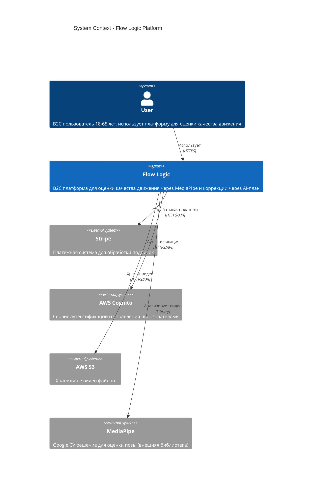
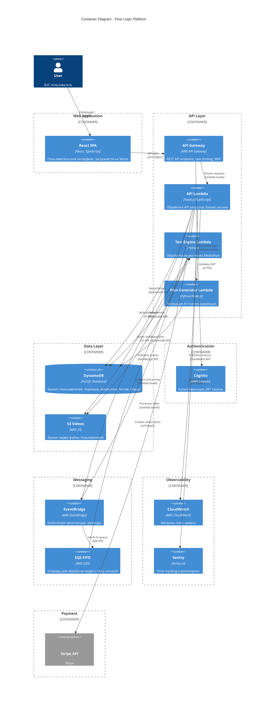
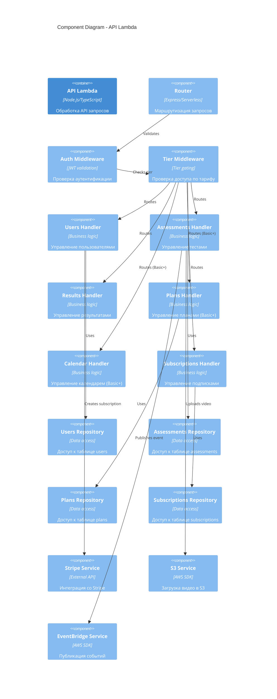

# 🏗️ C4 Diagrams — Flow Logic Architecture

**Версия:** 1.0  
**Дата:** 2025-12-22  
**Источник требований:** `docs/requirements/PRD.md` (PRD 2.1) — **единственный источник истины для всех агентов**

---

## 📊 Level 1: System Context Diagram

---

## 📦 Level 2: Container Diagram

---

## 🔧 Level 3: Component Diagram (API Lambda)

---

## 📝 Примечания к диаграммам

### Ключевые компоненты:

1. **Frontend (React SPA)**
   - Развертывается на Vercel
   - Коммуницирует с API через REST
   - Управляет состоянием через React Context/Redux

2. **API Layer**
   - API Gateway: точка входа, rate limiting, WAF
   - API Lambda: основная бизнес-логика
   - Test Engine Lambda: обработка видео через MediaPipe
   - Plan Generator Lambda: генерация AI планов

3. **Data Layer**
   - DynamoDB: все данные приложения (users, assessments, plans, subscriptions)
   - S3: хранение видео файлов

4. **Messaging**
   - EventBridge: event-driven архитектура
   - SQS FIFO: очередь для обработки видео с retry логикой

5. **External Services**
   - Cognito: аутентификация
   - Stripe: платежи
   - MediaPipe: анализ видео (library)

### Потоки данных:

1. **Video Upload Flow:**
   - User → SPA → API Gateway → API Lambda → S3
   - S3 → EventBridge → Test Engine Lambda → MediaPipe → DynamoDB

2. **Plan Generation Flow:**
   - Assessment completed → EventBridge → Plan Generator Lambda → DynamoDB

3. **Subscription Flow:**
   - User → SPA → API Gateway → API Lambda → Stripe → DynamoDB

---

**Следующий уровень:** Component diagrams для каждого Lambda handler (опционально, для детального проектирования)

