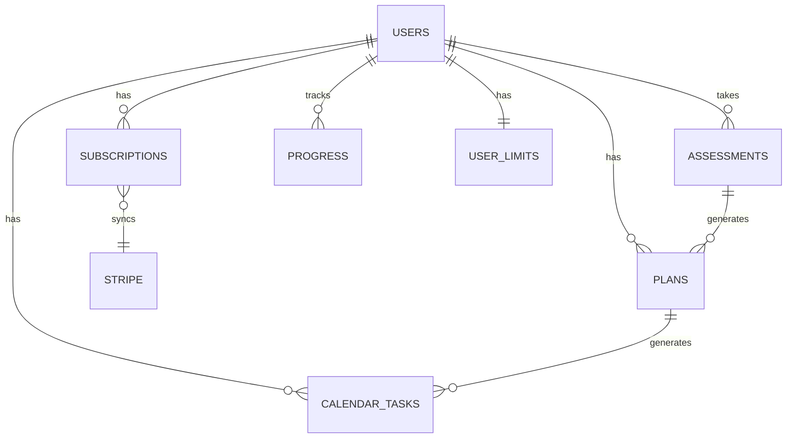

# 🗄️ Database Schema — Flow Logic (DynamoDB)

**Версия:** 1.0  
**Дата:** 2025-12-22  
**Источник требований:** `docs/requirements/PRD.md` (PRD 2.1) — **единственный источник истины для всех агентов**

---

## 📊 Обзор схемы

Flow Logic использует **DynamoDB** (NoSQL) для хранения всех данных. Схема оптимизирована для:
- Serverless архитектуры (Lambda)
- Масштабируемости (PAY_PER_REQUEST)
- Безопасности (KMS encryption)
- Event-driven архитектуры (DynamoDB Streams)

---

## 📋 Таблицы

### 1. `flowlogic-{stage}-users`

**Назначение:** Хранит информацию о пользователях

**Key Schema:**
- Partition Key: `user_id` (String, UUID)
- Sort Key: отсутствует

**Global Secondary Indexes:**
- `email-index`: Partition Key = `email` (String)

**Атрибуты:**
```typescript
{
  user_id: string;              // PK, UUID
  email: string;                // GSI, unique
  name?: string;                // Опционально
  tier: "free" | "basic" | "pro" | "proplus";
  wellness_disclaimer_accepted: boolean;
  wellness_disclaimer_accepted_at: string; // ISO timestamp
  created_at: string;           // ISO timestamp
  updated_at: string;           // ISO timestamp
  last_login_at?: string;       // ISO timestamp
}
```

**DynamoDB Streams:** Enabled (NEW_AND_OLD_IMAGES)

**Encryption:** KMS (SSE-S3 with KMS key)

---

### 2. `flowlogic-{stage}-subscriptions`

**Назначение:** Хранит подписки пользователей (Stripe)

**Key Schema:**
- Partition Key: `user_id` (String, UUID)
- Sort Key: `subscription_id` (String, Stripe subscription ID)

**Global Secondary Indexes:**
- `stripe-customer-index`: Partition Key = `stripe_customer_id` (String)

**Атрибуты:**
```typescript
{
  user_id: string;              // PK
  subscription_id: string;      // SK, Stripe subscription ID
  stripe_customer_id: string;   // GSI
  tier: "basic" | "pro" | "proplus";
  status: "active" | "canceled" | "past_due" | "expired";
  current_period_start: string; // ISO timestamp
  current_period_end: string;   // ISO timestamp
  cancel_at_period_end: boolean;
  canceled_at?: string;         // ISO timestamp
  created_at: string;          // ISO timestamp
  updated_at: string;           // ISO timestamp
}
```

**DynamoDB Streams:** Enabled

**Encryption:** KMS

---

### 3. `flowlogic-{stage}-assessments`

**Назначение:** Хранит результаты тестов MediaPipe

**Key Schema:**
- Partition Key: `user_id` (String, UUID)
- Sort Key: `assessment_id` (String, UUID)

**Global Secondary Indexes:**
- `test-type-index`: Partition Key = `test_id` (Number, 1-15), Sort Key = `created_at` (String)
- `month-index`: Partition Key = `month_key` (String, "YYYY-MM"), Sort Key = `created_at` (String)

**Атрибуты:**
```typescript
{
  user_id: string;              // PK
  assessment_id: string;        // SK, UUID
  test_id: number;              // 1-15 (Elite catalog)
  test_name: string;            // "Overhead Squat", "Y-Balance", etc.
  video_url: string;            // S3 URL
  status: "processing" | "completed" | "failed" | "invalid";
  attempt_number: number;       // 1-3 per day
  quality_score?: number;       // 0.0-1.0
  confidence_avg?: number;      // 0.0-1.0
  motion_variance?: number;     // 0.0-1.0
  result: {
    score: "pass" | "limited" | "significant";
    confidence: number;          // 0.0-1.0
    problem_areas?: string[];   // ["ankle", "hip", "core"]
    normalized_output?: object; // Детальные данные
  };
  feedback?: string;            // Причина ошибки (если status = invalid)
  created_at: string;           // ISO timestamp
  completed_at?: string;        // ISO timestamp
  month_key: string;            // "YYYY-MM" для monthly cap
}
```

**DynamoDB Streams:** Enabled

**Encryption:** KMS

---

### 4. `flowlogic-{stage}-plans`

**Назначение:** Хранит планы коррекции (Basic+)

**Key Schema:**
- Partition Key: `user_id` (String, UUID)
- Sort Key: `plan_id` (String, UUID)

**Global Secondary Indexes:**
- `active-index`: Partition Key = `is_active` (Boolean), Sort Key = `created_at` (String)

**Атрибуты:**
```typescript
{
  user_id: string;              // PK
  plan_id: string;              // SK, UUID
  tier: "basic" | "pro" | "proplus";
  is_active: boolean;           // GSI
  based_on_tests: number[];    // [1, 3, 7] - test IDs
  problem_areas: {
    p1: string[];              // Root cause candidates
    p2: string[];              // Consequence patterns
  };
  exercises: Array<{
    exercise_id: string;
    name: string;
    description: string;
    priority: "must" | "should";
    problem_area: string;
  }>;
  phases: Array<{
    phase_id: string;
    duration_weeks: number;
    focus: string;
    exercises: string[];       // exercise IDs
  }>;
  created_at: string;           // ISO timestamp
  updated_at: string;           // ISO timestamp
  version: number;              // Для отслеживания изменений
}
```

**DynamoDB Streams:** Enabled

**Encryption:** KMS

---

### 5. `flowlogic-{stage}-calendar-tasks`

**Назначение:** Хранит ежедневные задачи календаря (Basic+)

**Key Schema:**
- Partition Key: `user_id` (String, UUID)
- Sort Key: `task_date` (String, "YYYY-MM-DD") + `task_id` (String, UUID)

**Global Secondary Indexes:**
- `date-index`: Partition Key = `task_date` (String), Sort Key = `created_at` (String)

**Атрибуты:**
```typescript
{
  user_id: string;              // PK
  task_date: string;           // "YYYY-MM-DD"
  task_id: string;              // SK suffix, UUID
  exercise_id: string;         // Ссылка на exercise из plan
  priority: "must" | "should";
  completed: boolean;
  completed_at?: string;        // ISO timestamp
  created_at: string;           // ISO timestamp
}
```

**DynamoDB Streams:** Enabled

**Encryption:** KMS

---

### 6. `flowlogic-{stage}-progress`

**Назначение:** Хранит прогресс пользователя (Basic+)

**Key Schema:**
- Partition Key: `user_id` (String, UUID)
- Sort Key: `date` (String, "YYYY-MM-DD")

**Global Secondary Indexes:**
- `streak-index`: Partition Key = `user_id` (String), Sort Key = `streak` (Number, descending)

**Атрибуты:**
```typescript
{
  user_id: string;              // PK
  date: string;                 // SK, "YYYY-MM-DD"
  completion_percentage: number; // 0-100
  tasks_completed: number;
  tasks_total: number;
  streak: number;              // Текущий streak
  streak_points: number;       // +2 (100%), +1 (70-99%), +0 (<70%)
  test_improvements?: {
    test_id: number;
    improvement_percentage: number;
  }[];
  created_at: string;          // ISO timestamp
  updated_at: string;          // ISO timestamp
}
```

**DynamoDB Streams:** Enabled

**Encryption:** KMS

---

### 7. `flowlogic-{stage}-user-limits`

**Назначение:** Хранит лимиты и квоты пользователя (защита от абьюза)

**Key Schema:**
- Partition Key: `user_id` (String, UUID)
- Sort Key: отсутствует

**Атрибуты:**
```typescript
{
  user_id: string;              // PK
  plan: "free" | "basic" | "pro" | "proplus";
  video_quota_used_daily: number;
  video_quota_day: number;      // 9 (Free/Basic), 21 (Pro), 45 (Pro+)
  video_quota_used_hourly: number;
  video_quota_hour: number;     // 5 (baseline)
  test_quota_used_monthly: number;
  test_quota_month: number;     // 3 (Free/Basic), 7 (Pro), 15 (Pro+)
  attempts_per_test: Record<number, number>; // test_id -> attempts today
  ban_until?: string;           // ISO timestamp
  ban_reason?: string;          // "VIDEO_ABUSE", etc.
  updated_at: string;           // ISO timestamp
}
```

**DynamoDB Streams:** Enabled

**Encryption:** KMS

---

### 8. `flowlogic-{stage}-migrations`

**Назначение:** Отслеживает примененные миграции БД

**Key Schema:**
- Partition Key: `version` (String, "001", "002", etc.)

**Атрибуты:**
```typescript
{
  version: string;              // PK
  applied_at: string;           // ISO timestamp
  description: string;
  author: string;
}
```

**DynamoDB Streams:** Disabled

**Encryption:** KMS

---

## 🔗 Связи между таблицами



---

## 📊 Access Patterns

### Users
- **Get by user_id:** PK lookup
- **Get by email:** GSI `email-index`

### Subscriptions
- **Get active subscription:** PK = user_id, filter by status = "active"
- **Get by Stripe customer:** GSI `stripe-customer-index`

### Assessments
- **Get user assessments:** PK = user_id
- **Get by test type:** GSI `test-type-index`
- **Get monthly assessments:** GSI `month-index` (для monthly cap)

### Plans
- **Get active plan:** PK = user_id, GSI `active-index`, filter is_active = true

### Calendar Tasks
- **Get tasks for date:** PK = user_id, SK begins_with = "YYYY-MM-DD"
- **Get tasks by date range:** GSI `date-index`

### Progress
- **Get progress for date:** PK = user_id, SK = "YYYY-MM-DD"
- **Get top streaks:** GSI `streak-index` (descending)

### User Limits
- **Get limits:** PK = user_id
- **Update limits:** Atomic update с conditional expressions

---

## 🔐 Безопасность

- **Encryption at Rest:** KMS (SSE-KMS) для всех таблиц
- **Encryption in Transit:** TLS 1.3
- **Access Control:** IAM policies с least privilege
- **PII Masking:** Email и user_id не логируются

---

## 📈 Масштабируемость

- **Billing Mode:** PAY_PER_REQUEST (автоматическое масштабирование)
- **Read/Write Capacity:** Автоматическое (on-demand)
- **Partition Strategy:** user_id как PK для равномерного распределения
- **Hot Partition Protection:** GSI для разных access patterns

---

## 🔄 DynamoDB Streams

Все таблицы (кроме migrations) имеют включенные Streams для:
- Event-driven архитектуры
- Real-time обновлений
- Audit trail
- Интеграции с EventBridge

---

**Следующий шаг:** API спецификация (api_spec.yaml)

